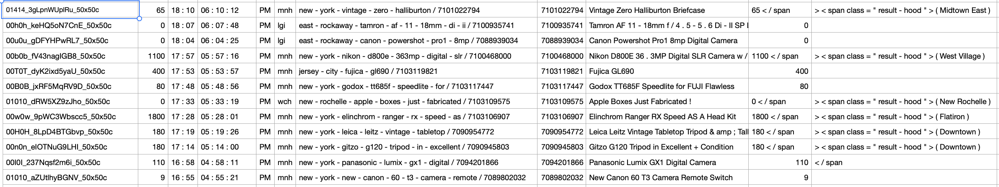

# Sift

An experimental system for extracting structured data from the raw HTML served
by web sites.

In 2021, this was left in the proof-of-concept phase because commercial services doing
the same thing appeared (Diffbot), so the market no longer seemed like it was just there
for the taking.

## What it does

**Sift takes as input raw HTML (from search results, product listings, job listings, whatever),
and produces a CSV file in which  each row is a single item,
and each column has the values of a particular field.**

For example, the input HTML may look like `data/craigslist1-clipped-labeled.html`, which is 
excerpted from Craigslist search results, and begins thus:

```html
<li class="result-row" data-pid="7101023051" data-repost-of="7080444552">
    <a href="https://newyork.craigslist.org/mnh/pho/d/new-york-fiberbilt-case/7101023051.html" class="result-image gallery" data-ids="1:00505_948kGKEcogn,1:00G0G_dPrpQCHn8Ap">
        
        <span class="result-price">$25</span></a>
    <p class="result-info">
        <span class="icon icon-star" role="button" title="save this post in your favorites list">
            <span class="screen-reader-text">favorite this post</span></span>
        <time class="result-date" datetime="2020-04-03 18:11" title="Fri 03 Apr 06:11:27 PM">Apr 3</time>
        <a href="https://newyork.craigslist.org/mnh/pho/d/new-york-fiberbilt-case/7101023051.html" data-id="7101023051" class="result-title hdrlnk">FIBERBILT CASE</a>
        <span class="result-meta">
            <span class="result-price">$25</span>
            <span class="result-hood"> (Midtown East)</span>
            <span class="result-tags"><span class="pictag">pic</span></span>
            <span class="banish icon icon-trash" role="button">
                <span class="screen-reader-text">hide this posting</span></span>
            <span class="unbanish icon icon-trash red" role="button" aria-hidden="true"></span>
            <a href="https://newyork.craigslist.org/d/photo-video/search/pha#" class="restore-link">
                <span class="restore-narrow-text">restore</span>
                <span class="restore-wide-text">restore this posting</span></a>
        </span>
    </p>
</li>
<li class="result-row" data-pid="7101022794" data-repost-of="7080591499">
[ ... ]
```

(_Why does the filename includes "labeled"?_ I put some labeling markup in that 
file to help with automated evaluation; this is stripped out in pre-processing
and is _not_ seen by the model.)

The first step is to build a model of the process by which the page is 
generated; the model can then be used continue extracting data from similar
pages. But to make experimentation convenient, these two steps are combined
in the `experiment` command. Here's an example invocation on the data above:

```bash
sbt stage

WORK_DIR=/tmp/sift-demo
mkdir -p $WORK_DIR

time ./target/universal/stage/bin/experiment \
  --input-file data/craigslist1-clipped-labeled.html \
  --output-file $WORK_DIR/craigslist-demo.out \
  --tsv-file $WORK_DIR/craiglist-demo.tsv \
  --frequency-count-lattice --frequency-ngram-size 3 --arc-prior-weight 1 --min-arc-freq 20 \
  --frequency-cutoff 6 --states 60 --strategy fb --max-epochs 99 --tolerance 3e-6 \
  --data-arc-levels 3 --data-arc-cost 2 --order-prior 3.0 --merge-data \
    | tee $WORK_DIR/craiglist-demo.log 
```

This produces a CSV file that starts like this:


This successfully puts the price in one column, the location in another column, etc. But it's 
clearly not yet perfect; e.g., the the price appears twice (because it appears twice 
in the actual HTML), and the second occurrance sometimes—but not always—includes the following 
"`</span`". (That appears to be contingent on whether the optional location (the next column) is 
specified in the HTML or not.) Such problems could be corrected by downstream code, but they are
symptomatic of an undesired fragility in the model's behavior.

(You may also have noticed that while the time is divided among 4 columns (another 
correctable annoyance), the date is missing. That's because the posting date doesn't vary in 
this one sample, so the model thinks it's static, not generated from data. This _could_ be 
addressed in a production use case by providing sample data from across different dates, but 
would be better addressed with a date-finding hack.)

(Also note that that is truncated not just vertically, but horizontally. And some of the fields 
to the right contain garbage (which is OK; the consumer of the data can strip them out). Also, if 
you open the CSV and scroll far enough to the right, the fields will repeat; that's because each 
row actually has _two_ items. This can also be fixed downstream, but it's pretty embarrassing, and 
means that more model tuning is needed.)

## How it works

In a nutshell, Sift searches a subspace of finite-state stochastic Markov models to find the one 
that generates the HTML with the highest probability, and assigns states to data fields.

Sift analyzes its input in the following steps:
1. Convert the input into a _lattice_: a directed acyclic graph in which each arc corresponds to 
   a substring of the output. Each path through the lattice represents a different way of 
   segmenting the input into substrings. The choice of arcs is determined by a heuristic that uses 
   occurrence counts. The purpose of this is to avoid wasteful computation by biasing the search 
   in the next step toward useful segmentations.
2. Fit a Markov model to generate the input by finding the highest-likelihood path through the 
   lattice generated in step 1. This uses a generalization of the Baum-Welch algorithm for 
   training HMMs: instead of generating a _sequence_, it generates a path through the _lattice_. 
   This is implemented in [StructuredDocumentModel.scala](src/main/scala/structureextractor/markovlattice/StructuredDocumentModel.scala).

Some states of the model always generate the same string (or a few minor variations); these are 
the constants in the web app that generated the HTML. Other states vary a lot, and correspond to 
columns in the CSV output. The arcs from those low-information states are called "data arcs" in 
the code.

As the set of hyperparameters specified in the demo command above should make clear, a number 
of enhancements to the sketch just made were necessary to make this work on real data. For 
example, the `--data-arc-cost` sets a constant prior probability on generating each token of
data, as opposed to a non-data arc. The idea is, we want to model the behavior of the web app that 
generated the data (which sometimes
generates static HTML, and sometimes generates a string based on whatever was retrieved from a
database); we don't want 
to waste states on trying to model data itself. 

Finally, to do inference on some HTML, we perform Viterbi search using the model—i.e., find the 
sequence 
of states and arcs (substrings) that generate the data with the highest likelihood. States that 
generate data arcs are assigned columns in the output table. Row by row, the Viterbi decoding 
assigns substrings to any fields (columns) whose corresponding state is entered.
